<!-- Intro by Ben -->
Take a seat, grab your popcorn, and join us with for our data story!!

With an extensive dataset of movies, actors, and movie synopsis at our disposal we set on a journey to put on a spotlight on how biological sex influences career paths in the movie industry. The opening scene of our data story that sets the stage for our future analysis is this simple, but revealing plot:

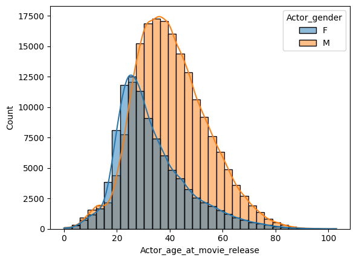

The data paints a clear picture: females frequently secure roles at an earlier age, reaching a career peak in their mid-twenties. In stark contrast, males follow a different script, attaining their career zenith later, typically in their late thirties. Intrigued by what forces drive this shift in career timelines and what other plots we would uncover we set off to analyze the careers of thousands of actors in the industry.

For this we employ different analytical techniques. We utilize Markov chains to understand how actors transitions between genres , Shift-Timeseries to probe for age-related shifts actors careers, and adapt a method for DNA-Analysis to find similar careers. Find out who's the only Female that has a career equivalent to Jason Statham, Mel Gibson and Sean Connery or what Carrie Fisher and Chris Hemsworth have in common.

While most of our analysis centers around genres, because its data is readily available, a big part of our work was to be able to take these analyses to the domain of which character types are played by which actors. Drawing inspiration from the script of [Learning Latent Personas of Film Characters](https://www.cs.cmu.edu/~ark/personas/) (2013) and extending upon it, we use modern Natural Language Processing (NLP) to extract character data from movie synopses, enhancing our exploration with a panoramic view of character tropes.

# Characterizing genres

Because a lot of our later analytical methods depend on having a coherent genre
clustering we put effort into structuring the more than **360**
genres available in the Dataset.

## Genre clustering
<!-- Romain -->

A first idea to reduce the number of genres is to do clustering and then define main genres by hand. Therefore we need to define a distance between each genre. As it appears that a movie is defined by several genres, **the co-occurrence of genres will be used to quantify their proximity** (high co-occurrence means close genres).

A naive approach would be to directly do a clustering on the 363 genres. However,this clustering is not satisfying due to the **nature of our data**: one genre can be expressed in several ways (ex: “Comedy and Comedy film”) and one genre can represent in reality several genres (ex: “Comedy-drama”). A manual filtering has to be done before clustering.

We **filter** the genres by not taking into account the genres with less than 500 movies (it does not significantly lower the number of films with genres) and by gathering the others into 30 custom main genres **by hand**. Looking now at the co-occurrence matrix, the **cluster appears** and it is confirmed by the dendrogram. The threshold of the clustering algorithm is chosen such that we have a **dozen of main genres**.

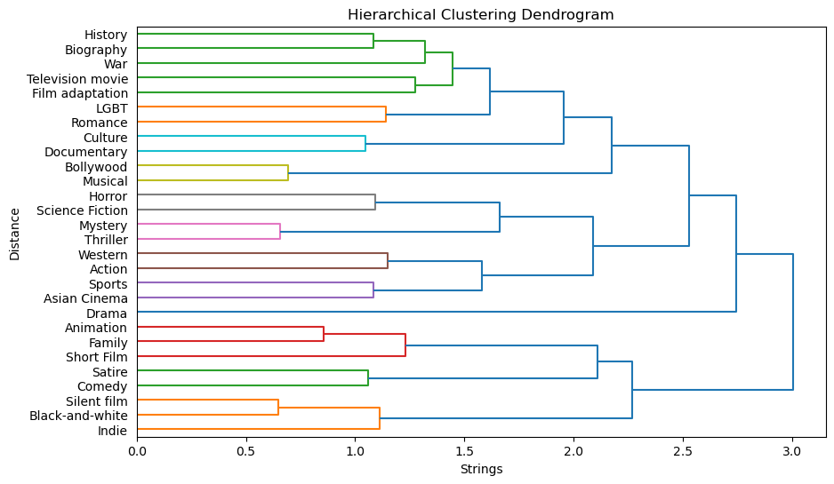

Looking at the repartition of genres along time, **clear trends appear** like the fall of Black & White and silent movies. 

## Creating "Eigengenres" - PCA analysis
<!-- Augustin -->
The task of reducing the number of genres can also be seen as a dimensionality reduction task, for which we have one great technique : **Principal Component Analysis**. Its idea is to project each movie onto all its genres (one-hot encoding) and then find the directions that explains the most variance of the dataset. Hence, the found directions : the so-called **eigengenres** help us define fewer dimensions to describe the movie genres while keeping most of the information.

The explained variance from a specific eigengenre can be deduced from its eigenvalue. Ranking those according to the latter value will enable us to select only the most significant eigengenres. 

This figure shows that with only **52** eigengenres we can keep **90% of the information** contained in the dataset.

Visualizing those 52 eigengenres gives us the following plot:

If we take the third eigengenre from the left for instance, it groups genres that we would have fitted together : namely ‘silent_films’, ‘black_and_white’, and ‘short_films’. This eigengenre probably discriminates between old and new movies.

Another observation is that genres that are rarely used are not significant in established eigenvectors.

# Defining genre evolution through the career - Markov chains
<!-- Erwann -->
To delve into the dynamics of actor careers, we will try to see the trends in actors shifts in terms of genres during their career. To study that, we will use a transition matrix with a one step memory length. The goal is to be able to study if some genres are absorbent, i.e. if you start playing in these kinds of genres, you would do so during your whole career and if some are closer in a sense that you’re very likely to play them one after the other.

This approach would help actors decide on their career and forecast their potential future movie genres. If I start playing in a given genre, what would be the next genre I would play in?

## 1. Initial Genre Distribution
Initially, we plot the distribution (for each gender) of genres concerning lead roles. This unveils the initial spread across different genres.

The distributions generally align, except in instances such as action films (Which men are relatively more likely to play) and romance films (where women are more likely to play).

## 2. Actor Transition Matrices
Moving forward, we generate transition matrices for actors, capturing the shifts between each role. The matrix outlines transitions, acknowledging the challenge of studying career shifts at a granular, one-step interval which will be discussed later.

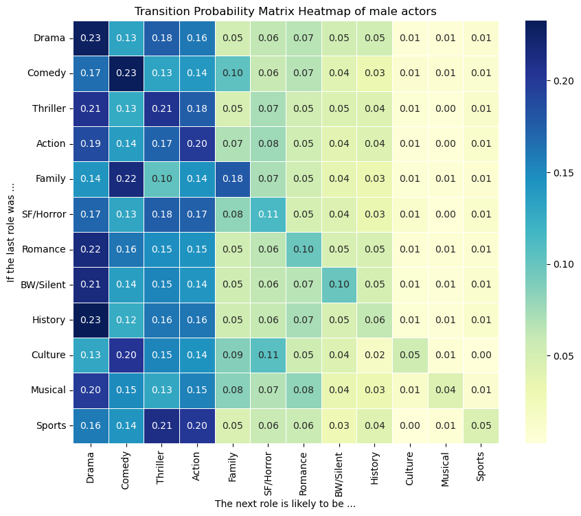

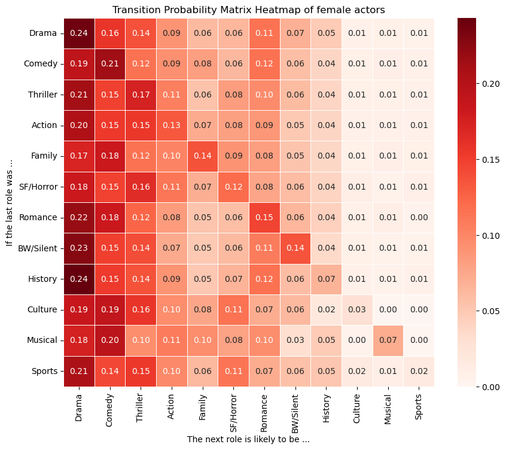

### Common Trends:

- *Genre Consistency*: Actors tend to **stay within the same genre**, influenced by the prevalence of that genre in the dataset.
- *Specific Genres' Persistence*: Certain genres, like Bollywood or Silent movies, have very high diagonal coefficients compared to their prevalence, reflecting historical prevalence during a period of time.
- *Closeness Amid Genres*: The transition matrix reveals intriguing **proximity between genres**. For instance, Drama and Thriller genres exhibit closer ties compared to Drama and Comedy. Despite Comedy's higher prevalence, transitions from Drama to Thriller movies are more frequent, illustrating a unique genre closeness.
- *Genre Attractors*: **Drama, Comedy, and Thriller** emerge as primary **attractors** for actors' roles, drawing them into these genres consistently.

### Key Differences:

- *Gender-Specific Preferences*: Men are inclined towards Action movies, while Romance films become a notable attraction for women.
- *Interlinked Genres*: Men associated with Family movies often transition to Comedy, signifying an inherent closeness between these two genres.

### Conclusion:

This analysis underscores how an actor's initial genre choice significantly influences their subsequent roles. Despite the diverse array of genres, **actors frequently gravitate towards major roles**, notably within Drama, Comedy, or Thriller genres. These findings illustrate not only the role of personal inclination but also the **interconnectedness** and evolving dynamics between different genres in shaping an actor's career trajectory.

## Assessment of Averaged Matrices

   - The distributed matrices are averaged by aggregating actors' career paths within each gender group. To **gauge the relevancy of these averaged matrices**, we measure the distance between each actor's transition matrix and their gender's average matrix (we focus on actors who played in more than 5 movies otherwise the transition matrix is not very relevant).
   - To maintain the accuracy of calculations, we address instances where a row in an actor's transition matrix is entirely zero. In such cases, we replace these zero rows with the equivalent rows from the averaged matrix.

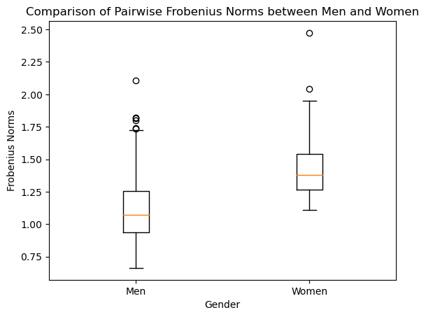

Using boxplots and t-tests, we observe that the Frobenius distance is significantly (p-value equals to 3e-26) higher for women compared to men. As a consequence, we can state that **women** who have a **long career** (more than 5 movies) tend to **get a more unique career** than their male counterparts.

Consequently, this divergence highlights **fewer conventional gender transitions for women**, indicating a more distinctive and atypical trajectory in their careers.

# Comparing career timelines among actors

We have a good description of the career of an actor through the transition matrix. However, this description is a summary of a career, we want now to look at the evolution of the actor through its life by looking at shifts in genres played.

## Shift time series
<!-- Romain -->
This method aims to characterize the change in genres played through a **scalar number each year the actor played**. To do that we first translate the genre obtained after the clustering for each movie into a vector of size the number of main genres and values 1 if the movie belongs to the genre, 0 otherwise. Then, for each age at which the actor played we compute the mean vector and we try to **detect shifts** in these vectors.

The scalar value used to quantify the shift is at the heart of this method. In our analysis, we use, at a given age, the films three years before and after this age to detect the shift. We compute the **mean cosine distance** between the vector of the current age studied and the vectors of the 3 previous years and to balance this value we use the **standard deviation** of the distance between the current age vector and those of the surrounding years.

This method works quite well for actors with long careers as for Brad Pitt and Sandra Bullock. 

<html lang="en">
<head>
  <meta charset="UTF-8">
  <meta name="viewport" content="width=device-width * 1.5, initial-scale=1.0">
  <title>Two Images Side by Side</title>
  
</head>
<body>

  

    
Brad Pitt

    
  

  

    
Sandra Bullock

    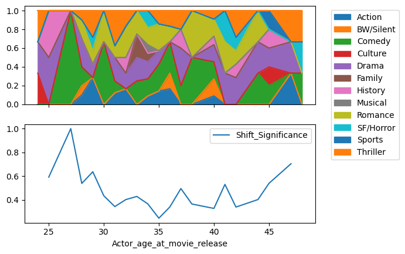
  

</body>
</html>

But it does not reveal any difference between men and women's career paths. Maybe the difference is not significant but it can also be due to a lack of actors with very long careers or a lack of movies in careers of the actors in our data.

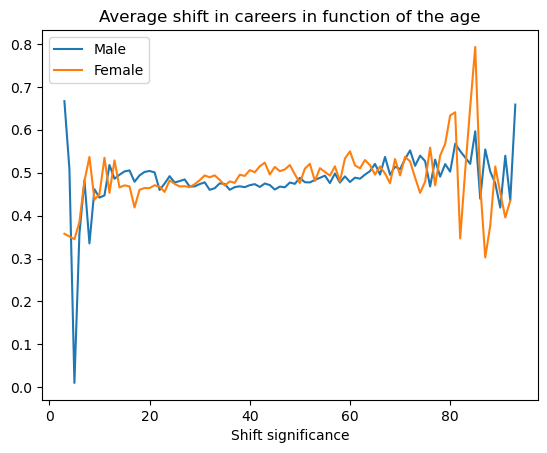

## Using the Levenshtein distance
<!-- Lucas -->
So far, most of our analyzes have not considered the actors' careers as a whole. In this part, we will try to compare and cluster careers, represented as sequences, with the Levenshtein distance.

Levenshtein distance is a popular tool in biology (it allows to compare DNA sequences for instance) that has been taken up by the social sciences to compare people's lives and choices. It was for instance used in the paper "Do social capital and project type vary across career paths in project-based work ?" (2008), from P.Skilton and J.Bravo, to compare career paths between Hollywood personal assistants.

The concept of the Levenshtein distance is the following : using the three elementary operations (insertion, deletion or substitution of one element), what is the **minimal number of operations needed to transform a sequence A into another sequence B ?**

Let's give an example : the Levenshtein distance between the two following strings/words 'levenshtein' and 'alewensstein' is 3 (at best, 1 insertion of a character and 2 substitutions are needed to transform ‘levenshtein’ into ‘alewensstein’).

*How can we use this concept in our case ?*

For each actor, we get the list of its movies, sorted chronologically. Each movie is assigned to a certain genre. We can thus encode the actor’s career as a sequence of letters. For instance, if the career’s code of an actor is AAB, with A for Drama and B for Thriller, then this means that the actor has first played in 2 drama movies and then ended his career with a thriller.

Once we have encoded the career of every actor in the dataset, we can try to detect clusters (using k-medoids algorithm with precomputed Levenshtein distances between each pair of careers in the dataset). We tried k=20 clusters and “purified” them : for each cluster, we computed the Levenshtein distance between each actor in the cluster and its medoid actor, calculated the median Levenshtein distance, and removed any actor with a distance above this value.

Although we can not give the list of all actors by cluster, we can explain below what are the common main features shared between all actors’ careers in each cluster (see table below).

Once our clusters were formed, we computed the women percentage in each of them. Observing some important variations from one cluster to another and knowing the overall percentage of women in the whole dataset (before clustering), we performed binomial tests to measure how significant these percentages were. Here are our results : 

These are very interesting results ! We observe **huge disparities in women representation** from one cluster to another.
Let's focus on clusters where the p-value is below 0.05, meaning that we can reject with confidence the null hypothesis that gender ratio in the cluster at hand is the same than in the entire dataset (meaning gender inequality is very likely to exist in this cluster).

In this regard, we can say that : 
- "Jason Biggs" cluster (average/long career, mostly based on romances) has 62% of women, which is very high compared to the overall percentage in the dataset
- "Jason Statham" cluster (long career, with many action movies) only has 5% of women ! This is extremely low.
- "James Franco" cluster (quite a long career, with some history/biopic movies at the beginning, then mostly action movies) also only has 5% of women !
- "Ashley Green" cluster (rather short career, with a lot of SF/horror/fantasy movies) has 51% of women (quite high percentage)
- "Robert Patrick" cluster (small career, most roles obtained in musicals) has 55% of women (quite high percentage)
- "Jean Simmons" cluster (average-length career, mostly filled with drama movies) has 55% of women (quite high percentage)
- "Clara Bow" cluster (actors from the classical Hollywood era (B&W movies), but with a shorter career than actors from the "Bette Davis" cluster) has 60% of women (sidekicks to male star actors ?)

Here is an example of the "Jason Statham" cluster. Note that Angelina Jolie is the only Female representative of this career cluster. 

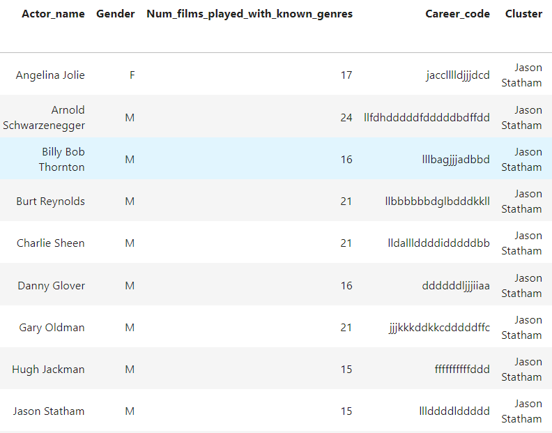

# Opening question : is it possible to define a career through character types ?

Using our own NLP model, we have tried to assign a type/trope for each "significant" (at least 5 related sentences in the corresponding movie synopsis) character in the dataset (about 30k characters labeled). Since we know the name of the actor/actress for each character in this dataframe, can we use this data to observe differences in the types of characters men and women are asked to play ?

We have defined seven character types : 
**Complex Personalities, Adventurers and Heroes, Stereotypes and Tropes, Occupation and Professions, Moral Ambiguity and Antagonists, Everyday Characters and Tropes, Emotional and Romantic Tropes**

For 1814 actors and 1084 actresses, we have vectorized their career in terms of character types they played, by counting the number of occurrences in each type and then normalizing the vector.  

Having encoded as a vector the types of characters played by each actor in our dataset, we can perform PCA to see if some trends can be observed. PCA will compute the eigenvectors out of the dataset, giving us the typical type of career (in terms of characters tropes) an actor had.

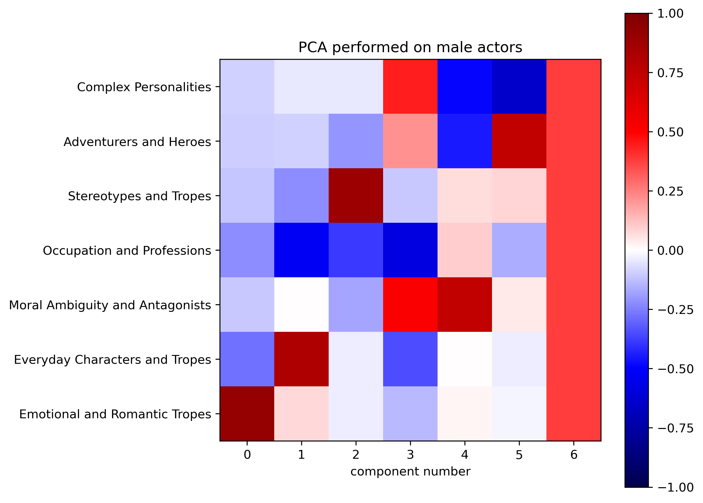

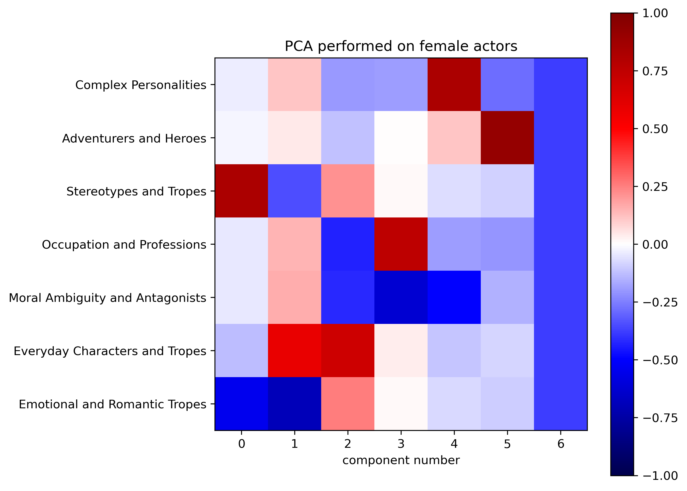

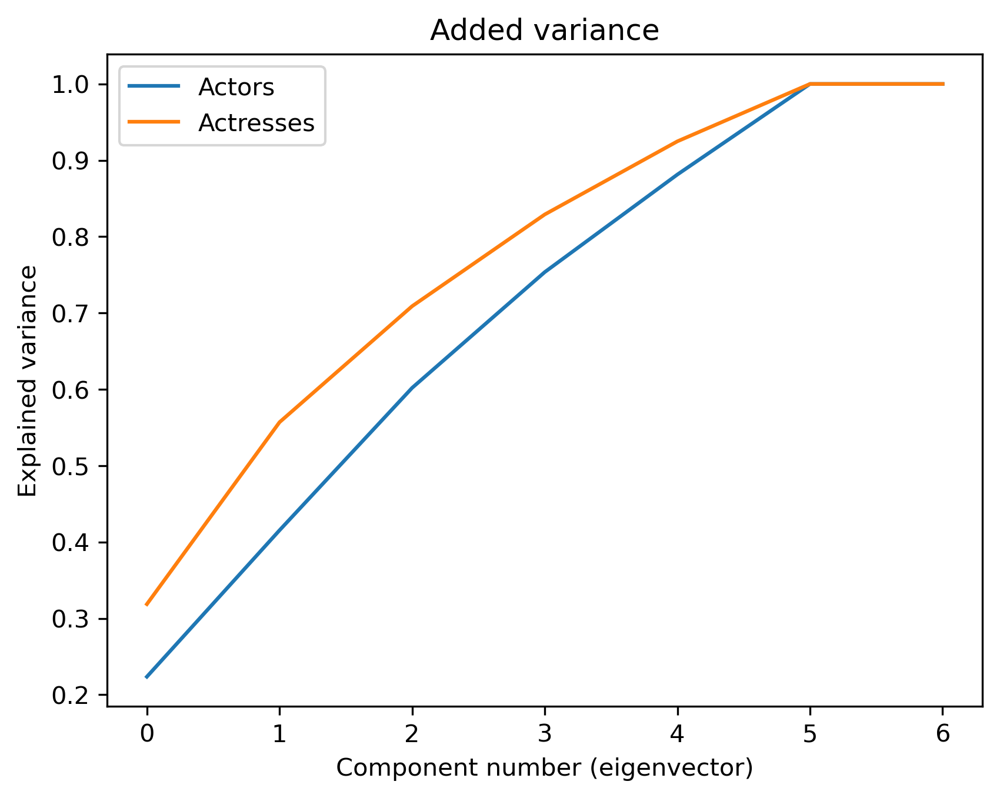

From the three graphs above, one can see that :
-  Women are firstly asked to play "stereotyped" roles. This is all the more significant that the added variance explained by the first eigenvector is higher for women than men. For men, it is "romantic and emotional" characters that appear first.
-  "Everyday Character" is a strong second eigenvector for both genders.
-  Women are not often asked to play “antagonists and morally ambiguous characters” (every eigenvector has a weak projection on this component), while it is the fourth and fifth most important eigenvectors for men.

# Conclusion
<!-- Ben -->
In the closing scene of our exploration into gender dynamics within the movie
industry, we'd like to point out once more the highlights of our data story. 

We could show that the gravitational forces of genres for Men and Women are not the same. Our exploration of the dataset has unveiled the pull of 
genres on actors. Some genres, such as  Drama, Comedy, and Thriller are universally attracting. Other genres, such as Romance and Action show a much more gender-specific attraction.

We were able to expand on this findings with our results from our selfmade NLP-Classification of character types played by sex. We revealed that women are more cast into sterotyped roles. 

With career timelines found something interesting: While the gravitational forces in the field are
different, the dynamics of actors switching genres is similar between men and women (at least for
established actors with longer careers). We also saw no age dependent spikes in genre switches, which is surprising, given the obvious difference age has on men and women in the industry.

Looking at career paths as a whole we could find groups of actors that shared similar careers over time. Our results show statistically how under- or overrepresented women are in these career paths. The results again underscore the findings from our other analyses and would lend themselves well for more in depth analyses and case studies (such as Angelina Jolie braking into the Action field). 

Looking ahead, we recommend applying these methodologies to compare evolving
time periods, acknowledging the industry's ongoing transformation toward
greater
 equality. The dataset's mid-2010s cutoff, makes a
 renewed exploration
into the industry's present landscape interesting. As the curtains close
 on our
data journey our findings prompt for contemplation on the interplay between
cinema,
 gender, and societal evolution.