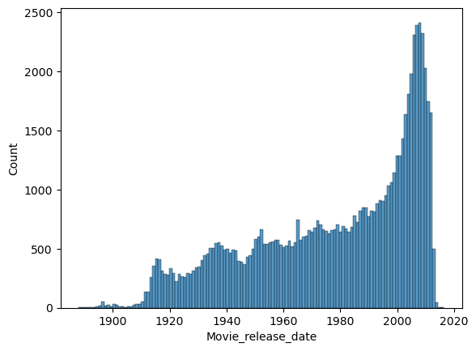

# Loading of the data

@Ben a bit scrapping to do to extract the ethincity from the freebase ID in the character 

# Choice of movies
We might want to restrict the movies under study to have a consistent dataset.
For instance :
- A time span (between 60 and 180 min)
- A specific language (English ?)
- Specific countries of origin : our subject is about Hollywood so restrict to USA.

- number of movies seem to crumble just before the end of the database, should restrict the end as well ?

# Caveats
- Careful with the months and days of the release dates of movies, as many have only a given year, and are automatically set to 01.01.year !

